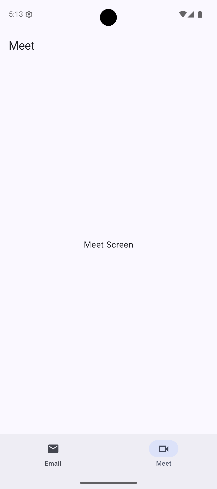
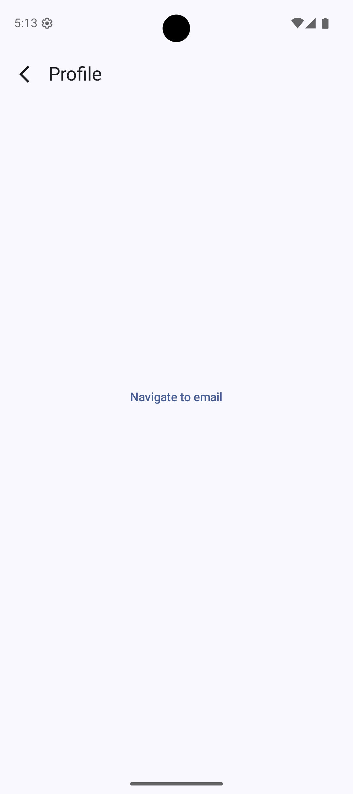

# 📱 Jetpack Compose Navigation Demo

A clean, minimal demo project showcasing **type-safe navigation**, **bottom bar navigation**, and **conditional UI (BottomBar visibility)** using **Jetpack Compose**.

This project focuses on **clarity**, **scalability**, and **modern Compose best practices** — useful as a starter or reference for real-world apps.

---

## ✨ Features

* 🧭 **Type-safe navigation** using `@Serializable` routes
* 🧱 **Bottom navigation bar** with multiple tabs
* 🙈 **Conditional BottomBar visibility** (hidden on specific screens like Profile)
* 🎬 **Animated transitions** between destinations
* 🧠 **Manual back stack handling** (no NavController)
* 🧩 Easy to extend with new screens

---

## 🗂  🧭 Bottom Bar Navigation Hierarchy

```


The app uses a single back stack where the Bottom Bar defines the top-level destinations.

App Root
└── BottomBar (Top-Level)
    ├── EmailScreen
    ├── MeetScreen
    └── ProfileScreen (outside BottomBar scope)

```

---

## 🎥 Demo

A short walkthrough showing:
- Bottom bar navigation
- Drawer navigation
- Full-screen Profile screen
- Back stack behavior

## 🎥 Demo Video

https://raw.githubusercontent.com/androAkash/Nested-Navigation-3/main/mainVideo.mp4


## 🧭 Navigation Model

Each screen is represented as a **serializable object**, making navigation fully type-safe.

```kotlin
@Serializable
data object EmailScreen : NavKey

@Serializable
data object MeetScreen : NavKey

@Serializable
data object ProfileScreen : NavKey
```

---

## 🧠 Back Stack Management

Instead of using `NavController`, the app maintains its own back stack:

```kotlin
val backStack = remember { mutableStateListOf<Any>(EmailScreen) }
```

### Why this approach?

* Full control over navigation
* Easier animations
* No hidden lifecycle complexity
* Works great for custom flows

---

## 📌 Bottom Bar Logic

The BottomBar is displayed **only for main tabs**.

```kotlin
val showBottomBar = backStack.last() !is ProfileScreen
```

This allows screens like **Profile**, **Details**, or **Full-screen flows** to hide the BottomBar automatically.

---

## 🎬 Screen Transitions

Animated transitions are applied using `AnimatedContent`:

* Slide + Fade animations
* Direction-aware navigation
* Smooth UX

This keeps navigation visually clear and polished.

---

## 🖼 Screenshots

| Screen  | Preview                          |
| ------- |----------------------------------|
| Email   |  |
| Meet    |    |
| Profile |           |
| Drawer  |             |

---

## 🚀 How to Extend

* Add a new screen by creating a new `@Serializable` object
* Push it to the back stack
* Decide whether it should show the BottomBar

The architecture scales cleanly without refactors.

---

## 🧪 Ideal For

* Learning **Compose Navigation internals**
* Building **custom navigation systems**
* Apps that need **full UI control**
* Interview-ready Compose samples

---

## 📄 License

Free to use, modify, and learn from.

---

If you want, I can also:

* Simplify this further
* Add architecture diagrams
* Convert it into a library-style README
* Improve visuals or badges

Just tell me 👍
